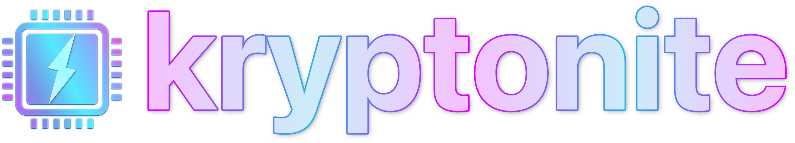

  

Kryptonite enables external GPUs on Macs using Thunderbolt 1 and 2 without compromising on Mac security features such as **System Integrity Protection**, **FileVault**, and **Authenticated-Root**.

# [Click Here to Begin](https://github.com/mayankk2308/kryptonite/wiki).